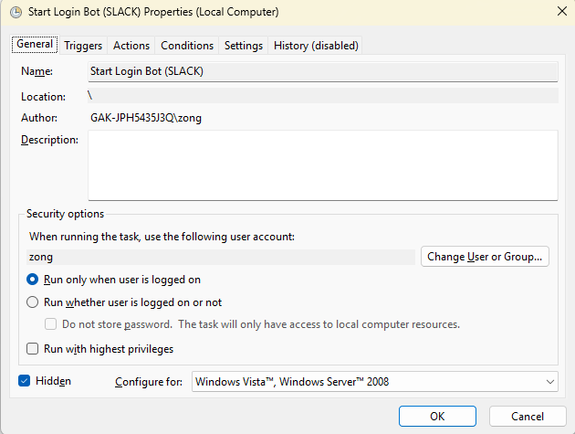
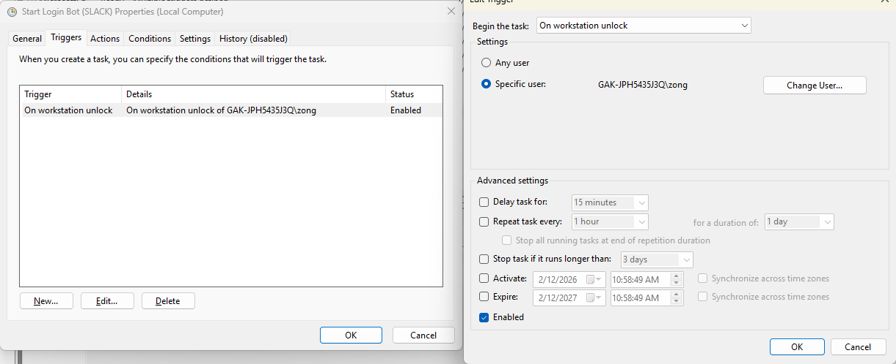
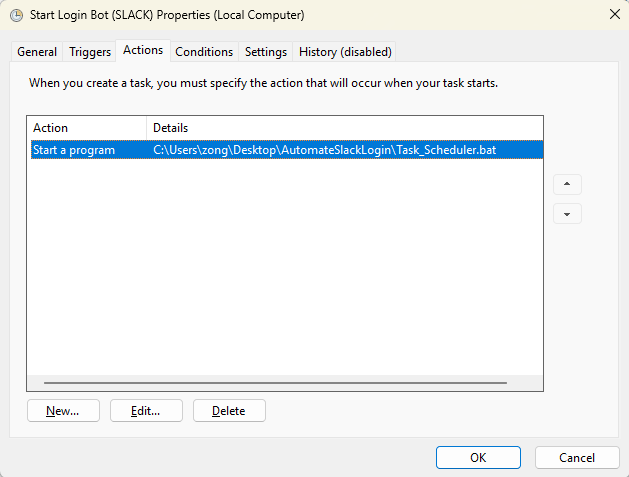
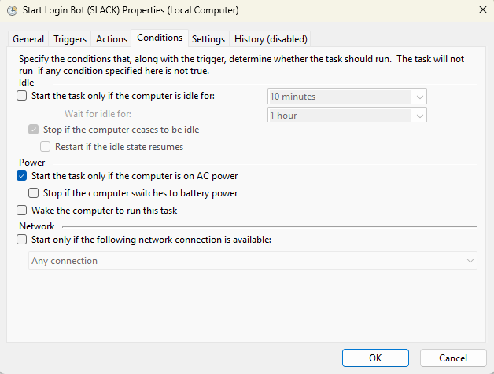
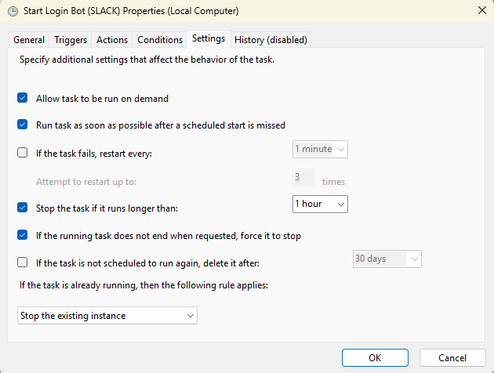

# Slack Auto-Login

Automate signing in to Slack (e.g. after daily session timeout). Uses Selenium with **auto-detected ChromeDriver** and **TOTP** for 2FA so the script can generate the code from your secret key.

## Quick start

1. **Create `.env` from the example**
   ```powershell
   copy .env.example and create another .env
   ```
   Edit `.env` and set:
   - `SLACK_EMAIL` – your Slack email
   - `SLACK_PASSWORD` – your Slack password
   - `SLACK_TOTP_SECRET` – your 2FA secret key (base32, from Slack’s “Set up authenticator app” → “Enter key manually”)

2. **Run Slack_Login.bat**
   Double‑click **Slack_Login.bat**. It runs everything step by step:
   - **Check if Python exists** (looks for `python`, `py`, or Python in standard install folders).
   - **If Python is not installed:** runs `library\Install_Python.bat` to install Python 3.12 via winget, then **automatically relaunches** Slack_Login in a new window so the rest runs without you doing anything else.
   - **If Python is found:** upgrades pip → installs dependencies → runs the Slack auto-login script.

   You only need to run **Slack_Login.bat** once; no need to rerun manually after Python is installed.

3. **Manual run (optional)**  
   If you prefer to run from a terminal:
   ```powershell
   pip install -r library\requirements.txt
   python library\slack_auto_login.py
   ```
   If `python` is not in your PATH, use `py -3` instead of `python`.

4. **2FA**  
   If `SLACK_TOTP_SECRET` is set, the script generates the current 6‑digit code and fills it in. If not set, the script waits and you can enter the code manually.

---

## Automatic run with Task Scheduler (run once per day on unlock)

If you get logged out every day and typically reach the office around **8:30–9:30**, you can have Slack auto-login run **once** in that window when you unlock your PC, and not again for the rest of the day.

### How it works

- **Task_Scheduler.bat** is the wrapper you schedule. When it runs, it:
  - Checks a **flag file** (`ran_today.flag`) to see if it has already run **today**.
  - If it has run today → exits without doing anything (so later unlocks don’t trigger login).
  - If it has **not** run today → checks the **time window 8:30–9:30**. Only if the current time is in that window does it run **Slack_Login.bat**, then sets the flag for today.

So: one automatic run per day, only in the 8:30–9:30 window when you unlock. Unlocks outside that window or later in the day do nothing.

### Add the task to Windows Task Scheduler

**No pop-ups (Windows):** Use **StartSlackAutomation(Invisible).vbs** instead of `Task_Scheduler.bat` in the Actions step below. The VBS runs the scheduler in the background with no command window. If you're on Windows and don't want any windows to appear, use this file.

1. Open **Task Scheduler** (e.g. search “Task Scheduler” in Start).

   

2. **Create Task** (not “Create Basic Task”). In **General**, name it e.g. “Slack Auto-Login”, and choose “Run only when user is logged on” (or “Run whether user is logged on or not” if you prefer).

   

3. **Triggers** → New → **On workstation unlock** (or **At log on** if you prefer). Optionally set a time range (e.g. 8:00–10:00) so the task only fires in the morning.

   

4. **Actions** → New → **Start a program**.  
   - **No pop-ups:** Program/script: your path to `StartSlackAutomation(Invisible).vbs` (e.g. `C:\Users\YourName\Desktop\AutomateSlackLogin\StartSlackAutomation(Invisible).vbs`).  
   - **Or** Program/script: your path to `Task_Scheduler.bat` (e.g. `C:\Users\YourName\Desktop\AutomateSlackLogin\Task_Scheduler.bat`).  
   - **Start in** (optional): `C:\path\to\AutomateSlackLogin`.

   

5. **Conditions:** Uncheck “Start the task only if the computer is on AC power” if you use a laptop on battery.

   

6. OK to save. The task runs when you unlock (or at log on). **Task_Scheduler.bat** ensures Slack_Login runs at most **once per day**, and only between **8:30 and 9:30**.

---

## Getting your TOTP secret (2FA key)

- In Slack: **Settings** → **Security** → **Two-Factor Authentication** → **Set up authenticator app** (or **Manage** if already set up).
- Choose **“Enter key manually”** (or similar) and copy the **secret key** (base32 string, often with spaces).
- Paste it into `.env` as `SLACK_TOTP_SECRET=`. You can leave or remove spaces; the script normalizes it.

---

## Env reference

| Variable | Required | Description |
|----------|----------|-------------|
| `SLACK_EMAIL` | Yes | Slack sign-in email |
| `SLACK_PASSWORD` | Yes | Slack password |
| `SLACK_TOTP_SECRET` | For auto 2FA | Base32 TOTP secret from Slack 2FA setup |
| `SLACK_SIGNIN_URL` | No | Slack sign-in URL; set if your workspace uses a different one |
---

## After login

The script leaves the browser open so you can use Slack. Press Enter in the terminal when you want to close it.

If your company uses a different sign-in URL, set `SLACK_SIGNIN_URL` in `.env`.
